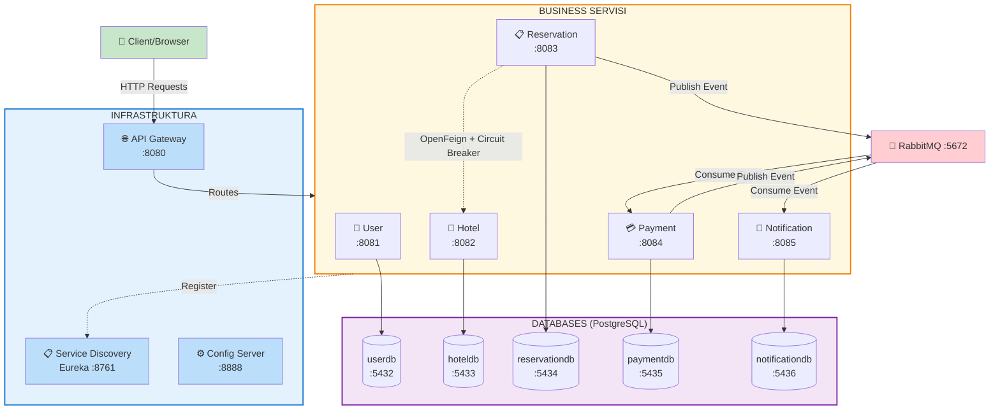

# Hotel Reservation System

Mikroservisni sistem za rezervaciju hotelskih soba razvijen korišćenjem Spring Cloud framework-a.

## Pregled Sistema

Sistem se sastoji od više nezavisnih mikroservisa koji komuniciraju međusobno kako sinhrono (REST API putem OpenFeign-a) tako i asinhrono (RabbitMQ message broker). Implementirani su svi ključni Spring Cloud paterni: Service Discovery, Centralizovana konfiguracija, API Gateway, Circuit Breaker i Database per Service.

## Arhitektura



**Ključne Komunikacije:**
- **Sinhrona**: Reservation Service ↔ Hotel Service (OpenFeign + Circuit Breaker)
- **Asinhrona**: Reservation → RabbitMQ → Payment → RabbitMQ → Notification
- **Discovery**: Svi servisi se registruju na Eureka Server
- **Pattern**: Database per Service (svaki servis ima svoju PostgreSQL bazu)

## Servisi

### Infrastrukturni Servisi
- **Eureka Server** (port 8761) - Service Discovery i registracija servisa
- **Config Server** (port 8888) - Centralizovana konfiguracija svih servisa
- **API Gateway** (port 8080) - Routing, load balancing i Circuit Breaker fallback-ovi

### Poslovni Servisi
- **User Service** (port 8081) - Registracija i autentifikacija korisnika (JWT, role-based access)
- **Hotel Service** (port 8082) - Upravljanje hotelima i sobama (CRUD operacije)
- **Reservation Service** (port 8083) - Upravljanje rezervacijama sa sinhronom komunikacijom (OpenFeign) i Circuit Breaker-om (Resilience4j)
- **Payment Service** (port 8084) - Asinhrona obrada plaćanja (RabbitMQ consumer/publisher)
- **Notification Service** (port 8085) - Slanje email notifikacija (RabbitMQ consumer)

## User Service API

User Service pruža autentifikaciju i upravljanje korisnicima sa JWT tokenima.

### Javni Endpoints (bez autentifikacije)
- `POST /api/users/register` - Registracija novog korisnika
- `POST /api/users/login` - Login i dobijanje JWT tokena

### Zaštićeni Endpoints
- `GET /api/users/{id}` - Detalji korisnika
- `PUT /api/users/{id}` - Ažuriranje korisnika

### Admin Endpoints
- `GET /api/users` - Lista svih korisnika
- `DELETE /api/users/{id}` - Brisanje korisnika

### Primer Login Request/Response
Request:
```json
{
  "usernameOrEmail": "john.doe@example.com",
  "password": "password123"
}
```
Response:
```json
{
  "token": "eyJhbGciOiJIUzI1NiIsInR5cCI6IkpXVCJ9...",
  "type": "Bearer",
  "userId": 2,
  "username": "johndoe",
  "email": "john.doe@example.com",
  "role": "ROLE_USER"
}
```

## Hotel Service API

Hotel Service upravlja hotelima i sobama.

### Hotel Endpoints
- `POST /api/hotels` - Kreiranje hotela
- `GET /api/hotels` - Lista svih hotela
- `GET /api/hotels/{id}` - Hotel po ID-u
- `PUT /api/hotels/{id}` - Ažuriranje hotela
- `DELETE /api/hotels/{id}` - Brisanje hotela

### Sobe Endpoints
- `POST /api/rooms` - Kreiranje sobe
- `GET /api/rooms/{id}` - Soba po ID-u
- `GET /api/rooms/hotel/{hotelId}` - Sve sobe hotela
- `GET /api/rooms/hotel/{hotelId}/available` - Dostupne sobe hotela
- `GET /api/rooms/available` - Sve dostupne sobe
- `PUT /api/rooms/{id}` - Ažuriranje sobe
- `DELETE /api/rooms/{id}` - Brisanje sobe

### Primer Request Body (Hotel)
```json
{
  "name": "Grand Hotel Belgrade",
  "city": "Belgrade",
  "address": "Knez Mihailova 10",
  "description": "Luxury hotel in the heart of Belgrade",
  "stars": 5,
  "amenities": "WiFi, Pool, Spa, Restaurant"
}
```

### Primer Request Body (Soba)
```json
{
  "hotelId": 1,
  "roomNumber": "101",
  "type": "DOUBLE",
  "pricePerNight": 180.00,
  "capacity": 2,
  "description": "Spacious double room with city view"
}
```

## Reservation Service API

Reservation Service kreira rezervacije i komunicira sa Hotel Service-om putem OpenFeign klijenta. Implementiran je **Resilience4j Circuit Breaker** koji štiti sistem od pada Hotel Service-a.

### Sinhrona Komunikacija (OpenFeign + Circuit Breaker)
Reservation Service koristi **Spring Cloud OpenFeign** za REST pozive prema Hotel Service-u:
- Preuzimanje informacija o sobi i ceni
- Provera dostupnosti sobe
- Ažuriranje dostupnosti sobe nakon rezervacije

**Circuit Breaker** (Resilience4j) obezbeđuje fallback u slučaju nedostupnosti Hotel Service-a.

### Endpoints
- `POST /api/reservations` - Kreiranje nove rezervacije
- `GET /api/reservations` - Lista svih rezervacija
- `GET /api/reservations/{id}` - Rezervacija po ID-u
- `GET /api/reservations/number/{reservationNumber}` - Rezervacija po broju
- `GET /api/reservations/user/{userId}` - Rezervacije korisnika
- `PATCH /api/reservations/{id}/cancel` - Otkazivanje rezervacije

### Primer Request Body
```json
{
  "userId": 2,
  "roomId": 1,
  "guestName": "John Doe",
  "guestEmail": "john.doe@example.com",
  "checkInDate": "2026-08-01",
  "checkOutDate": "2026-08-05"
}
```

### Primer Response
```json
{
  "id": 1,
  "reservationNumber": "RES-A1B2C3D4",
  "userId": 2,
  "roomId": 1,
  "hotelId": 1,
  "guestName": "John Doe",
  "guestEmail": "john.doe@example.com",
  "checkInDate": "2026-08-01",
  "checkOutDate": "2026-08-05",
  "totalPrice": 720.00,
  "status": "CONFIRMED"
}
```

## Payment Service API

Payment Service prima RabbitMQ događaje od Reservation Service-a, automatski obrađuje plaćanje i objavljuje rezultat za Notification Service.

### Endpoints
- `GET /api/payments` - Lista svih plaćanja
- `GET /api/payments/{id}` - Plaćanje po ID-u
- `GET /api/payments/number/{paymentNumber}` - Plaćanje po broju
- `GET /api/payments/reservation/{reservationNumber}` - Plaćanje po rezervaciji
- `GET /api/payments/user/{userId}` - Plaćanja korisnika
- `GET /api/payments/status/{status}` - Plaćanja po statusu (PENDING, COMPLETED, FAILED, REFUNDED)

## Notification Service API

Notification Service prima RabbitMQ događaje od Payment Service-a i čuva notifikacije u bazi.

### Endpoints
- `GET /api/notifications` - Lista svih notifikacija (opcioni `?status=` filter)
- `GET /api/notifications/{id}` - Notifikacija po ID-u
- `GET /api/notifications/recipient/{recipient}` - Notifikacije po primaocu
- `GET /api/notifications/entity/{relatedEntityId}` - Notifikacije po entitetu

## Komunikacija između servisa

### Sinhrona komunikacija (REST/OpenFeign)
- **Reservation Service → Hotel Service**: validacija i rezervacija sobe
- Implementirano kroz Spring Cloud OpenFeign klijenta
- Zaštićeno Resilience4j Circuit Breaker-om

### Asinhrona komunikacija (RabbitMQ)

#### Reservation → Payment
- Exchange: `reservation.exchange` (TopicExchange)
- Queue: `reservation.created.queue`
- Routing Key: `reservation.created`

#### Payment → Notification
- Exchange: `payment.exchange` (TopicExchange)
- Queue: `payment.completed.queue`
- Routing Key: `payment.completed`

### Kompletan Flow
```
Klijent → POST /api/reservations
    → Reservation Service proverava sobu (OpenFeign → Hotel Service)
    → Kreira rezervaciju u bazi
    → Objavljuje ReservationEvent na RabbitMQ
        → Payment Service prima event
        → Obrađuje plaćanje, čuva u bazi
        → Objavljuje PaymentEvent na RabbitMQ
            → Notification Service prima event
            → Kreira i čuva email notifikaciju u bazi
```

## Tehnologije

- Java 21
- Spring Boot 3.3.4
- Spring Cloud 2023.0.3
- Spring Security + JWT (JSON Web Tokens)
- Spring Cloud OpenFeign (sinhrona komunikacija)
- Resilience4j Circuit Breaker
- PostgreSQL (Database per Service pattern)
- RabbitMQ (Message broker)
- Docker & Docker Compose
- Maven (multi-module projekat)
- JUnit 5 & Mockito
- JaCoCo (Code Coverage)

## Testiranje

### Pokretanje testova

```bash
# Svi testovi za ceo projekat
mvn clean test

# Testovi za specifičan servis
cd user-service
mvn test

# Sa code coverage izveštajem
mvn test jacoco:report
```

### Test konfiguracija
- **Test baza**: H2 in-memory database
- **Unit testovi**: Mockito (`@ExtendWith(MockitoExtension.class)`)
- **Controller testovi**: MockMvc (`@WebMvcTest`)
- **Integration testovi**: Spring Boot Test sa H2 bazom (`@SpringBootTest`)
- **External dependencies**: MockBean za Feign klijente i RabbitMQ

## Pokretanje Sistema

### Docker (Preporučeno)

```bash
# Build svih servisa
mvn clean package -DskipTests

# Pokretanje svih servisa
docker compose up --build -d

# Provera statusa
docker compose ps

# Zaustavljanje
docker compose down
```

### Ručno pokretanje (bez Docker-a)

Potrebno pokrenuti servise **redom**:

```bash
# 1. Eureka Server
cd eureka-server && mvn spring-boot:run

# 2. Config Server
cd config-server && mvn spring-boot:run

# 3. Business servisi (svaki u posebnom terminalu)
cd user-service && mvn spring-boot:run
cd hotel-service && mvn spring-boot:run
cd reservation-service && mvn spring-boot:run
cd payment-service && mvn spring-boot:run
cd notification-service && mvn spring-boot:run

# 4. API Gateway
cd api-gateway && mvn spring-boot:run
```

> **Napomena**: RabbitMQ mora biti pokrenut pre business servisa. Instalacija: https://www.rabbitmq.com/download.html

### Provera da li sistem radi
- **Eureka Dashboard**: http://localhost:8761
- **RabbitMQ Management UI**: http://localhost:15672 (guest/guest)
- **API Gateway**: http://localhost:8080
- **Swagger UI**: `http://localhost:808X/swagger-ui.html` (gde X je 1-5 za svaki servis)

## Početni Podaci (Seed Data)

Sistem automatski učitava početne podatke pri prvom pokretanju.

### Korisnici
| Email | Lozinka | Uloga |
|-------|---------|-------|
| admin@hotelreservation.com | admin123 | ADMIN |
| john.doe@example.com | password123 | USER |
| jane.doe@example.com | password123 | USER |

### Hoteli i Sobe
- **Grand Hotel Belgrade** (5 zvezdica, Beograd) — 4 sobe: Single (120€), Double (180€), Deluxe (280€), Suite (350€)
- **Hotel Novi Sad** (4 zvezdice, Novi Sad) — 3 sobe: Single (80€), Double (130€), Twin (140€)
- **Mountain Resort Kopaonik** (4 zvezdice, Kopaonik) — 3 sobe: Single (100€), Double (160€), Suite (400€)

## CI/CD Pipeline

Projekat koristi **GitHub Actions** za automatizovani CI/CD proces.

### Pipeline Faze

```
BUILD → TEST → PACKAGE → DEPLOY-STAGING → DEPLOY-PRODUCTION
```

### Workflow Triggeri
- **Push na `main`**: Pokreće ceo pipeline uključujući deploy na Staging i Production
- **Push na `develop`**: Pokreće BUILD + TEST + PACKAGE faze
- **Pull Request**: Pokreće BUILD + TEST faze

### Faze

| Faza | Opis |
|------|------|
| **Build** | Kompajlira sve servise (`mvn clean compile`) |
| **Test** | Pokreće testove za svaki servis paralelno u matrix strategiji |
| **Package** | Pravi JAR i Docker image za svaki servis |
| **Deploy Staging** | Deploy na staging okruženje (na `main` branch) |
| **Deploy Production** | Deploy na produkciju sa kreiranjem release taga (manual approval) |

### Artifakti
- **Test rezultati**: JUnit Surefire izveštaji za svaki servis
- **Coverage izveštaji**: JaCoCo izveštaji za business servise
- **Docker images**: Sačuvani kao GitHub Actions artifakti

## Napomene

### Arhitekturni Paterni
- **Database per Service**: Svaki mikroservis ima svoju nezavisnu PostgreSQL bazu podataka
- **Service Discovery**: Eureka server za automatsku registraciju i discovery servisa
- **API Gateway**: Centralizovani ulaz sa routing-om i Circuit Breaker fallback-ovima
- **Event-Driven Architecture**: Asinhrona komunikacija kroz RabbitMQ
- **Circuit Breaker**: Resilience4j štiti Reservation Service od pada Hotel Service-a

### Data Persistence
- **Docker Volumes**: Podaci se čuvaju u named volumes i ostaju trajni posle restarta
- **Automatic Seeding**: `data.sql` fajlovi automatski popunjavaju baze pri prvom pokretanju
- **Hibernate DDL**: `ddl-auto: update` automatski kreira/ažurira tabele
